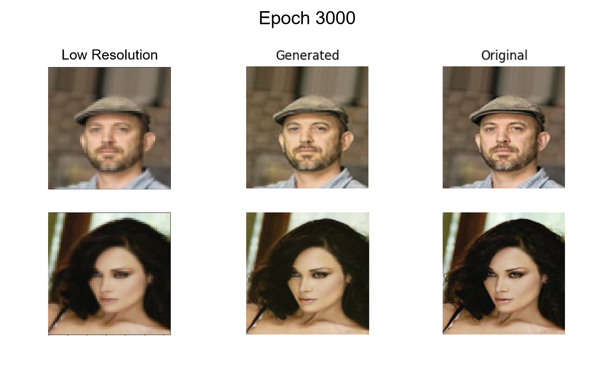

# Generative Adversarial Networks (GANs)

The repository is for studying GANs.

GAN Diagram (Just a funny explanation):
Generator helps Joker look like an ordinary person in Training Set then Batman (Discriminator) can not distinguish him and other people. Joker can join the ceremony.


## 1. Deep Convolutional GAN (DCGAN) Testing on MNIST Dataset:


## 2. Super Resolution GAN (SRGAN) Testing on CelebFaces Attributes (CelebA) Dataset:




## 3. How to run:
1. DCGAN:
```bashrc
$ python3 dcgan.py
```
2. SRGAN - Follow the steps at the beginning of srgan.py, then run the command:
```bashrc
$ python3 srgan.py
```

Nov. 2019

Tran Le Anh
