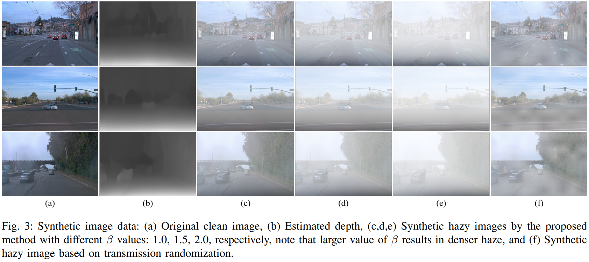
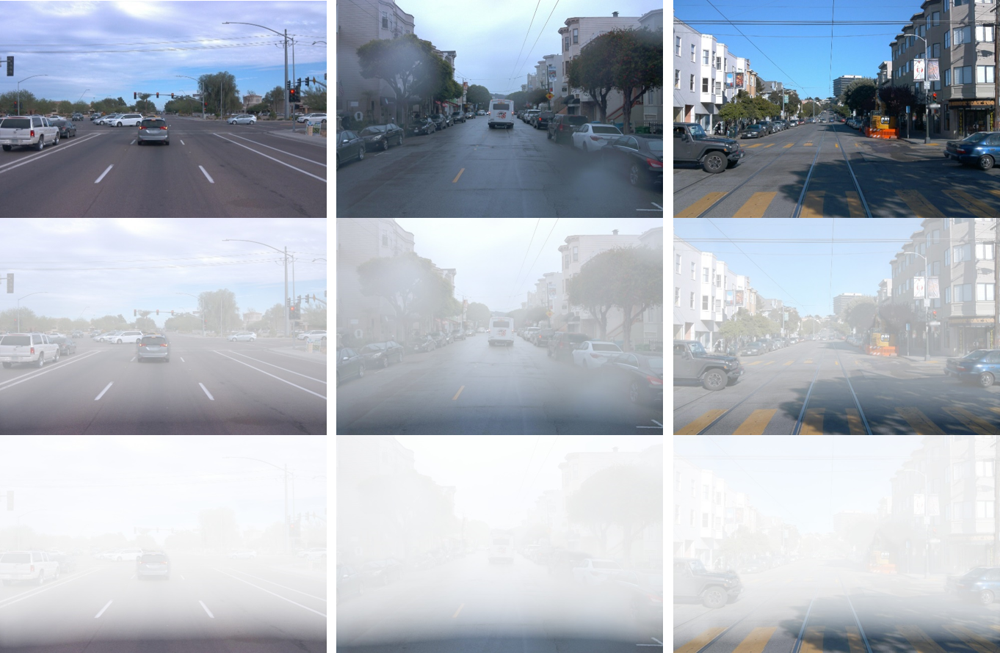

# Hazy/Dusty Image Synthesis for Driving Scenarios

Paper: Toward Improving Robustness of Object Detectors against Domain Shift (GECOST 2024) [[pdf](https://tranleanh.github.io/assets/pdf/GECOST_2024.pdf)] [[Medium](https://leanhtrann.medium.com/synthesize-hazy-foggy-image-using-monodepth-and-atmospheric-scattering-model-9850c721b74e)]

Authors: [Le-Anh Tran](https://scholar.google.com/citations?user=WzcUE5YAAAAJ&hl=en), [Chung Nguyen Tran](https://scholar.google.com/citations?user=NOlVIV4AAAAJ&hl=en), [Dong-Chul Park](https://scholar.google.com/citations?user=VZUH4sUAAAAJ&hl=en), [Jordi Carrabina](https://scholar.google.com/citations?user=V9-s3BIAAAAJ&hl=ca), [David Castells-Rufas](https://scholar.google.com/citations?user=srfRvBIAAAAJ&hl=en)

<!--- Medium: [Synthesize Hazy/Foggy Image using Monodepth and Atmospheric Scattering Model](https://leanhtrann.medium.com/synthesize-hazy-foggy-image-using-monodepth-and-atmospheric-scattering-model-9850c721b74e) --->
<pre>
<p align="center">

</p>
</pre>

### Dependencies
- Pytorch
- OpenCV

### Setup

(to be updated)

### Image Synthesis

(to be updated)

<!--- ### How to Use

#### 1. Generate Depth Map (using Monodepth2)
- An easy-to-use implementation of Monodepth2 can be reached via this [link](https://github.com/nianticlabs/monodepth2)

#### 2. Locate Image Files (optional)
- Put the original (clean) image in the folder "docs"
- Put the generated depth map in the folder "docs"
- Say "fname" is the file name of the clean image, the file name of the generated depth map should be "fname_depth"

#### 3. Generate Hazy Image
- Run notebook: synthesize-haze.ipynb

### Results
- 1st row: original images
- 2nd row: synthesized hazy images with sparse haze
- 3rd row: synthesized hazy images with dense haze
 --->

### Citation
```
@article{tran2022novel,
  title={A novel encoder-decoder network with guided transmission map for single image dehazing},
  author={Tran, Le-Anh and Moon, Seokyong and Park, Dong-Chul},
  journal={Procedia Computer Science},
  volume={204},
  pages={682--689},
  year={2022},
  publisher={Elsevier}
}
```

Have fun!

LA Tran
